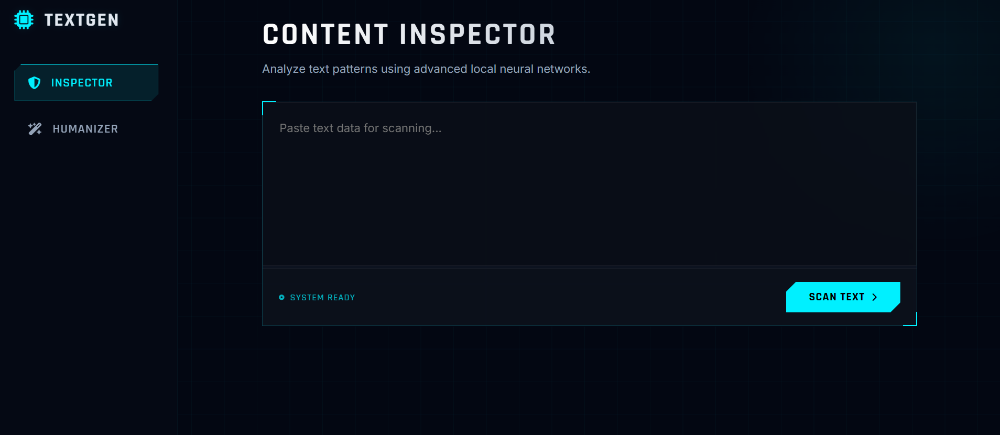

# AI vs Human - Hybrid Text Detection System

A full-stack AI-powered web application that detects whether a text is AI-generated or human-written and can also humanize AI-generated content.

## Application Preview

### Home Page


### AI Detection Result


### Humanization Feature


## Features

- AI-generated text detection using RoBERTa
- Rule-based linguistic pattern analysis
- Text humanization using T5-based paraphraser
- Full-stack architecture (Flask + Next.js)

---

## Tech Stack

### Backend
- Python
- Flask
- HuggingFace Transformers
- PyTorch

### Frontend
- Next.js
- React 19


## Project Structure

```
backend/
  app.py
  requirements.txt

frontend/
  package.json
  next.config.js


## Installation

### 1.Clone the repository


git clone https://github.com/sharmistha1980/ai-vs-human.git
cd ai-vs-human


### 2️.Backend Setup


cd backend
pip install -r requirements.txt
python app.py


Runs on: http://localhost:5000


### 3️.Frontend Setup

cd frontend
npm install
npm run dev

Runs on: http://localhost:3000


## Detection Logic

The system combines:

1. Transformer-based AI probability scoring
2. Rule-based AI phrase detection
3. Threshold-based classification

This hybrid approach improves robustness against false negatives.


## Future Improvements

- Deploy using Docker
- Add user authentication
- Improve scoring visualization
- Add API rate limiting


## Author

Sharmistha Chatterjee
