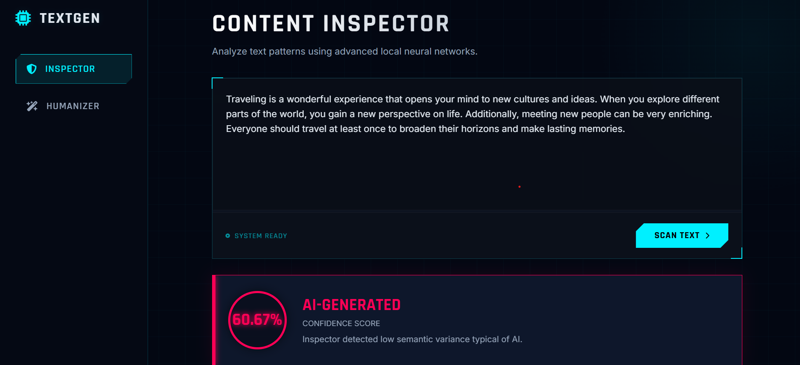

# AI vs Human – Hybrid Text Generation Detection System

A full-stack machine learning application that detects whether input text is AI-generated or human-written using a hybrid architecture combining transformer-based classification and rule-based linguistic heuristics. The system also includes a text humanization module powered by a T5 paraphrasing model.

---

## Overview

This project implements a hybrid AI detection pipeline:

1. Transformer-based probability scoring (RoBERTa OpenAI Detector)
2. Rule-based AI linguistic pattern analysis
3. Threshold-based ensemble decision logic
4. T5-based paraphrasing for humanization

The system exposes REST endpoints via Flask and integrates with a Next.js frontend for interactive testing.

---

##  Detection Architecture

### Model Layer
- `openai-community/roberta-base-openai-detector`
- Outputs raw probability scores
- Evaluates semantic AI likelihood

### Rule-Based Layer
Custom linguistic pattern scanner detects common AI writing markers:
- Structured discourse markers
- Predictable rhetorical patterns
- Repetitive semantic structure

Each detected pattern adds a weighted suspicion score.

### Final Classification
Final score = Model Probability + Pattern Boost

Decision threshold:
```
THRESHOLD = 0.10
```

This hybrid approach reduces false negatives that pure model-based systems may miss.

---

##  Humanization Module

- Model: `humarin/chatgpt_paraphraser_on_T5_base`
- Beam search enabled
- Repetition penalty applied
- Controlled temperature sampling

Used to rewrite AI-like text into more natural human-style output.

---

##  System Architecture

```
Frontend (Next.js + React)
        ↓
REST API (Flask)
        ↓
Transformers Pipeline
        ↓
Hybrid Scoring Engine
```

---

##  Tech Stack

### Backend
- Python 3.x
- Flask
- HuggingFace Transformers
- PyTorch

### Frontend
- Next.js 16
- React 19
- Node.js >= 20.9

### DevOps
- Docker (container-ready)
- Git version control

---

##  Application Preview

### Home Interface


### AI Detection Result



### Humanization Output


---

##  Local Setup

### 1️.Clone Repository

```
git clone https://github.com/sharmistha1980/AIvsHuman.git
cd AIvsHuman
```

---

### 2️.Backend Setup

```
pip install -r requirements.txt
python app.py
```

Runs at:
```
http://localhost:5000
```

---

### 3️.Frontend Setup

```
npm install
npm run dev
```

Runs at:
```
http://localhost:3000
```

---

## Key Engineering Considerations

- Model inference optimized via HuggingFace pipeline
- Threshold-based binary classification
- Modular architecture for future model upgrades

---

## Potential Improvements

- Model quantization for faster inference
- Confidence interval visualization
- API rate limiting
- Deployment on cloud (Render / Railway / AWS)
- CI/CD integration

---

## 👩‍💻 Author

Sharmistha Chatterjee  
Computer Science Engineering  
AI/ML Enthusiast
